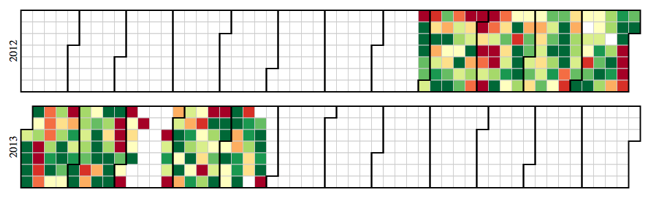

my-nike-data
============

WIP Just my Nike+ data v0.01

I wanted to build something with [Cloud 9](https://c9.io) so I made this with nodejs. It lets you code, fully in the cloud, thats pretty cool.
The app pulls in my Nike FuelBand data from the [Nike Plus API](https://developer.nike.com) on every page load and then 
visualizes it code from Mike Bostock's [Calendar View](http://bl.ocks.org/mbostock/4063318).

The latest version should be running on heroku: [andrew-nike-data.herokuapp.com](http://andrew-nike-data.herokuapp.com/), but if
not here is a recent screenshot:

### Get Started (on c9.io)
From https://c9.io/andrewringler/my-nike-data

Go to Terminal

    > export NIKE_ACCESS_TOKEN=your access token from https://developer.nike.com
    > npm install
    > node app
    
Then visit http://my-nike-data.andrewringler.c9.io

### Deploy to Heroku (from c9.io terminal)

    pushd
    cd
    wget http://assets.heroku.com/heroku-client/heroku-client.tgz
    tar xzfv heroku-client
    cd heroku-client/bin
    PATH=$PATH:$PWD

    popd
    heroku create
    heroku config:set NIKE_ACCESS_TOKEN=your access token from https://developer.nike.com
    git push heroku master
    
Then visit [andrew-nike-data.herokuapp.com](http://andrew-nike-data.herokuapp.com/)

### Thanks to
Mike Bostock's [Calendar View](http://bl.ocks.org/mbostock/4063318) for the visualization. Currently
it is copied pretty verbatim into index.hjs. Bostock request's 'fair use for educational purposes.'